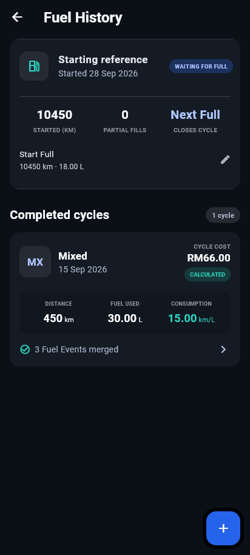
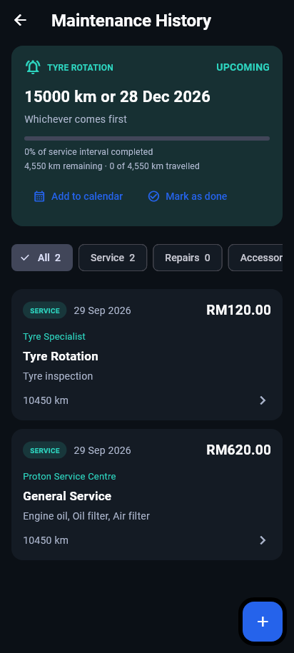
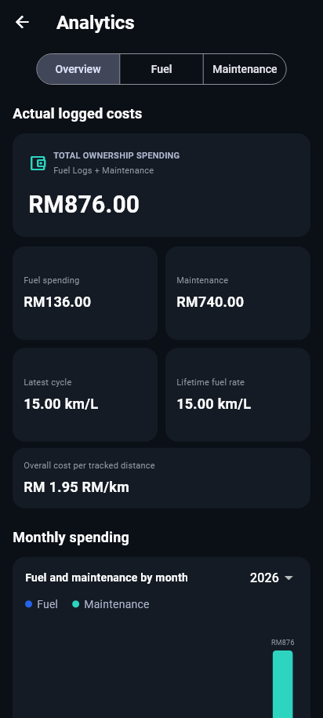

# Car Tracker

A private-first Android app for tracking fuel usage, maintenance, service reminders, and real ownership costs. I built it for my own car, but anyone who finds it useful is welcome to use it.

> **Android only.** This is a personal sideload build, not a Google Play Store release. All vehicle records stay locally on the device unless you explicitly export or back them up.

## Screenshots

<p align="center">
  
  
  
</p>

## Highlights

- Full-to-full fuel-cycle tracking, including partial fills
- Maintenance records, itemized costs, receipts, and service reminders
- Mileage alerts, date alerts, and calendar integration
- Fuel-efficiency and ownership-cost analytics
- Vehicle retirement/history, Excel exports, and full backup/restore

## Download

[**Download the latest Android APK**](https://github.com/Laxman1104/car-tracking-app/releases/latest/download/CarTracker-1.0.0-personal.apk)

Open the APK on your Android phone and allow installation from that browser or file manager if Android prompts you. Back up your app data before replacing or reinstalling the application.

## Development

Built with Flutter and Dart. To run it locally:

```bash
flutter pub get
flutter run
```

Automated checks are available through `flutter test`. This project is provided as-is without warranty.
